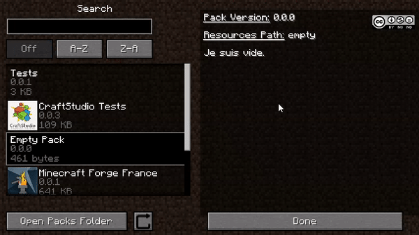

# Work with licence

As you probably know you can license your (Hard) work, to protect it.

Nuwa actually support the **Creative Commons** licenses

I'm not a professional on this subject.  
So, you can visit the [Creative Commons](https://creativecommons.org/licenses/?lang=en_US) official website and pick the license you want.

___

## Modifications

### content.pack

```json 
{
  "packName": "Ma Super Packy Pack", //mandatory
  "namespace": "super_pack", //mandatory
  "version": "0.0.1", //mandatory
  "authors" : ["ZeAmateis"], //optional
  "credits" : ["Thanks to my parents to bring me life."], //optional
  "description": [ //optional
    "That was ma super pack description !",
    "Yeah boiiii."
  ],
  "license" : "by" // <- Add this line.
}
```

___

## Values

The `license` property is a **String** value

??? example "List of supported Creative Commons license format by Nuwa"  
    - `by`  
    - `by-nc-nd`  
    - `by-nc-sa`  
    - `by-nc`
    - `by-nd`  
    - `by-sa`
    
??? tip "In-Game License Render"  
    