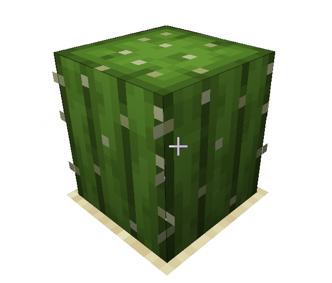
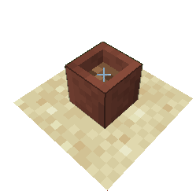

# `voxelShape` object

You can customize the Shape of your block.  
Precisely, the base `shape`, and `collisionShape` (hitboxes).  
    
**VoxelShapes** are not really complicated to understand, but it's to explain.

So, if your block's hitboxes doesn't need to be "resized", don't put this properties.

??? note "Example"  
    ```json
    [
      {
        "registryName": "test_voxel_shape",
        "voxelShape": {
          "shape": {
            "x1": 1,
            "y1": 0,
            "z1": 1,
            "x2": 15,
            "y2": 16,
            "z2": 15
          },
          "collisionShape": {
            "x1": 1,
            "y1": 0,
            "z1": 1,
            "x2": 15,
            "y2": 15,
            "z2": 15
          }
        }
      }
    ]
    ```
    
___

## Values

The `voxelShape` are a **JsonObject** (`{}`) with 3 configurables shapes objects.

Due to a cuboidal shape of these objects  
You need to define a starting and ending point of the shape.  
<sub>(Like the `/fill` command in Minecraft)</sub>

<u>Start Point Position</u> : `x1, y1, z1`  
<u>End Point Position</u> : `x2, y2, z2`  

Theses points accept **Integer** and **Decimal** values

```json
"shape" : {
      "x1": 1.0,
      "y1": 0,
      "z1": 1,
      "x2": 15.5,
      "y2": 16.12,
      "z2": 15
    }
```

??? note "Cactus Shape Example"  
    ```json
    "shape" : {
      "x1": 1,
      "y1": 0,
      "z1": 1,
      "x2": 15,
      "y2": 16,
      "z2": 15
    }
    ```
    
    
??? note "Flower Pot Shape Example"  
    ```json
    "shape" : {
      "x1": 5,
      "y1": 0,
      "z1": 5,
      "x2": 11,
      "y2": 6,
      "z2": 11
    }
    ```
    
    
So, basically that's the same way for the `collisionShape` or the `renderShape`

!!! tip  
    To make tests.  
    I probably implements a Voxel Shape pre renderer to test your values in-game.
    